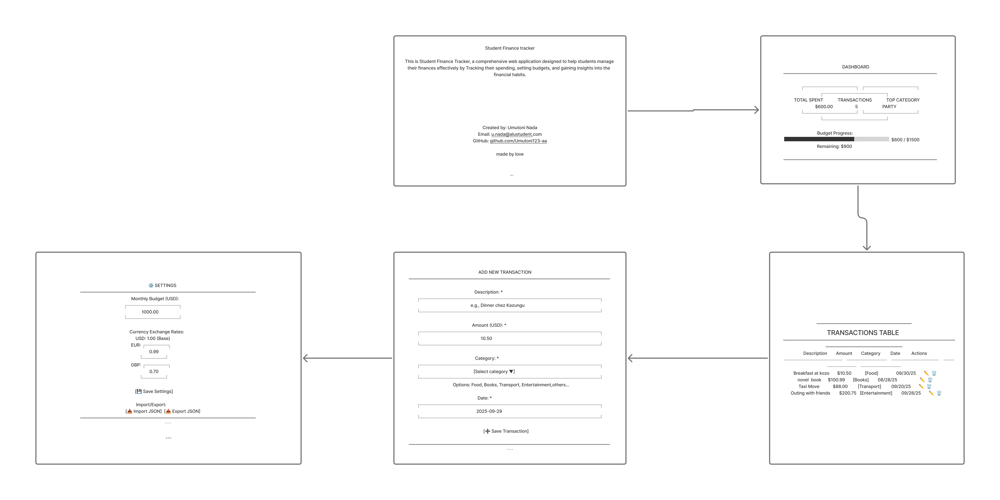

# frontend-web-dev-summative--Umutoni123-aa-

Student Finance Tracker
The Student Finance Tracker. A simple web application designed for students in need of a straightforward tool to manage their finances effectively. Whether you're tracking daily expenses, managing your budget, or analyzing your spending, this tool makes it easy to find what you need and take control of your financial life.


yt demo:  https://youtu.be/8PtMASBmSHU
## Features presented

### 1. **Pages/Sections**

- **About Page**: Contains project description, names (Umutoni Nada), and contact info
- **Dashboard**: Stats showing total spent, transaction count, top category, budget progress
- **Transactions***  Responsive card for mobile and machine by edit/delete actions
- **Settings**: Budget and currency exchange rates


Usage
Adding a Transaction
Click on the "Add Transaction" button in the navigation

Fill in the transaction details:
Description
Amount 
Category 
Date 
Click "save Transaction" to save

Managing Transactions
Edit
Delete
Search
Filter
Sort: to sort the transaction list

Dashboard
The dashboard provides an overview of your finances:

Total balance
Spending by category
Recent transactions
 spending trends

Settings
Customize the app to your preferences:

Change currency (USD, EUR, RWF)
Set a budget
Manage categories
Import/Export data
Data Privacy
All your financial data is stored locally in your web browser's localStorage. None of your data is sent to any server. It is safe and clean

Keyboard Navigation
The app is also keyboard accessible:

Tab: Navigate between interactive elements
Enter/Space: Activate buttons and links
Escape: Close modals and dialogs
Arrow keys: Navigate between form fields and table rows
Regular Expressions Used

## 📁 Project Structure

```
student-finance-tracker/
├── index.html              * Homepage
├── about.html              * About page with contact info
├── dashboard.html          * budget dashboard page
├── transactions.html       * Main transactions page
├── settings.html           * Settings and data management
├── tests.html              * sample 
├── seed.json               * Sample datas made
├── README.md               * This file(where all notes are noted)
│
├── styles/
│   └── main.css            * All styles (responsive, accessible)
│
├── scripts/
│   ├── storage.js          * LocalStorage operations
│   ├── state.js            * Application management
│   ├── validators.js       * worked on Regex validation functions
│   ├── search.js           * Search and sort logic
│   └── ui.js               * Event handling
│
└── assets/
    └── wireframes.png      * designs sketches.
```

Acknowledgments
Built with vanilla JavaScript, HTML5, and CSS3
learning/reference source.
I used W3Schools tutorials to understand more about responsive CSS techniques, such as media queries and flexible grids

Contact Information
Developer: Umutoni Nada
Email: u.nada@alustudent.com
GitHub: github.com/Umutoni123-aa
Course: Frontend Web Development
Year: 2025
